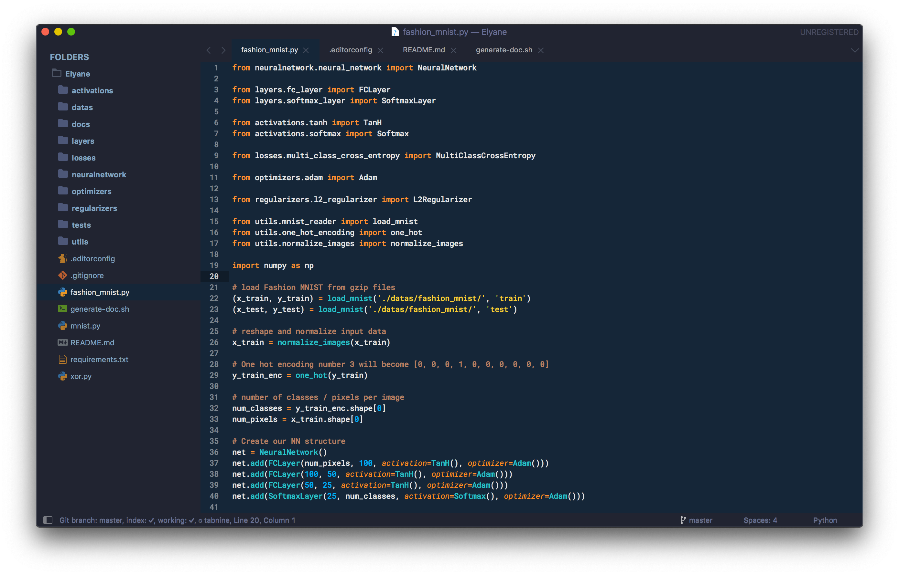
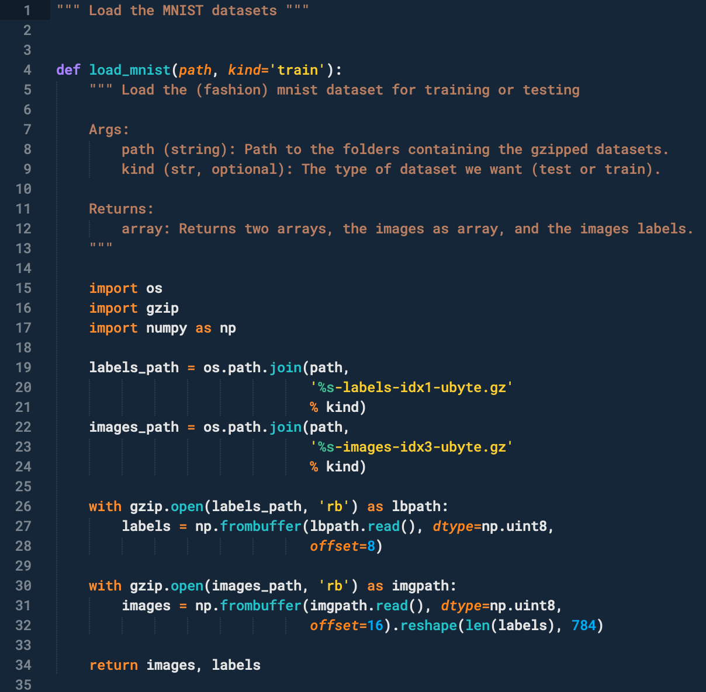
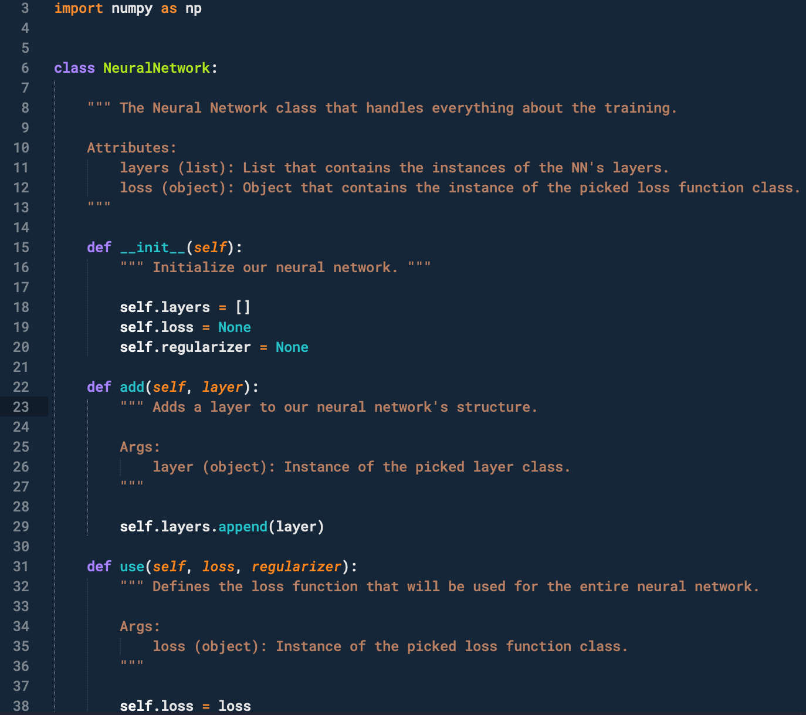
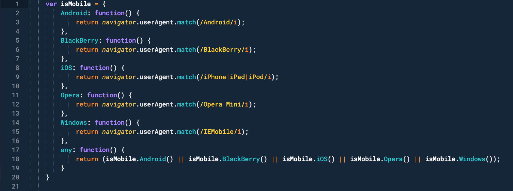

# Hivacruz Theme for Sublime Text

A dark blue Theme and Color Scheme for Sublime Text 3 and 4 (build 3211 and newer).



> The font used in the screenshot is [Roboto Mono Nerd Font](https://github.com/ryanoasis/nerd-fonts/blob/master/patched-fonts/RobotoMono/Regular/complete/Roboto%20Mono%20Nerd%20Font%20Complete.ttf), Medium, 12px.

## Installation

### Via Package Control

1. `Tools` → `Command Palette...` → `Package Control: Install Package` → `Hivacruz Theme`.
2. Go to `Preferences → Theme ...` and pick `Hivacruz` from the menu.
3. Go to `Preferences → Color Scheme ...` and pick `Hivacruz` from the menu.

### Manual Installation

1. Download the repository to your computer and rename the folder to "Hivacruz Theme".
2. Go to `Preferences → Browse packages` from the main menu.
3. Copy the folder `Hivacruz Theme` files to `Packages` (not inside the `User` folder).
4. Go to `Preferences → Theme ...` and pick `Hivacruz` from the menu.
5. Go to `Preferences → Color Scheme ...` and pick `Hivacruz` from the menu.

### File Icons

`Hivacruz` supports customization via [A File Icon](https://github.com/ihodev/a-file-icon) package. Please install it and restart Sublime for a better experience.


## Recommended settings

### Font

I'm using the **Roboto Mono Medium Nerd Font Complete** font in my screenshots. On macOS, you can install it with Homebrew, like this:

```
brew tap homebrew/cask-fonts
brew cask install font-robotomono-nerd-font
```

For other OSes, you can also find the font file  [here](https://github.com/ryanoasis/nerd-fonts/blob/master/patched-fonts/RobotoMono/Regular/complete/Roboto%20Mono%20Nerd%20Font%20Complete.ttf).

### Settings

Here is the my recommended settings for this theme – the ones used in the screenshots. To add them, go to `Preferences → Settings`. Add/replace the following lines:

```json
	"font_face": "Roboto Mono Medium Nerd Font Complete",
	"font_size": 12,
	"line_padding_bottom": 1,
	"line_padding_top": 1,
	"bold_folder_labels": true,
	"ensure_newline_at_eof_on_save": true,
	"index_files": true,
	"tab_size": 4,
	"translate_tabs_to_spaces": true,
	"trim_trailing_white_space_on_save": true,
	"word_wrap": true,
	"ensure_newline_at_eof_on_save": true,
	"caret_style": "blink",
	"draw_shadows": false
```

## Custom settings

If you would like to change a few things to make your experience better, you can easily customize the theme and the color scheme on ST4:

### Customize the Theme

To change something related to the theme (sidebar, title bar etc):

1. Pull up the command palette with <kbd>cmd/ctrl</kbd> + <kbd>shift</kbd> + <kbd>p</kbd>
2. Type in `Customize Theme` and press <kbd>Enter</kbd>. It will open a new window with two tabs opened: on the left, the default theme values ; on the right, your own customised values.

For example, if you want to change the sidebar font size (which is quite small by default), you can do that:

```json
// Documentation at https://www.sublimetext.com/docs/themes.html
{
    "variables":
    {
    },
    "rules":
    [
      {
         "class": "sidebar_label",
         "font.size": 13, // increase font size for sidebar folder/files
         "font.face": "Fira Code" // changing the font face as well
      },
    ]
}

```

More infos about Sublime Text theming rules can be found here: https://www.sublimetext.com/docs/themes.html.

### Customize the color scheme

To change something related to the color scheme (syntax highlighting of your code):

1. Pull up the command palette with <kbd>cmd/ctrl</kbd> + <kbd>shift</kbd> + <kbd>p</kbd>
2. Type in `Customize Color scheme` and press <kbd>Enter</kbd>. It will open a new window with two tabs opened: on the left, the default color scheme values ; on the right, your own customised values.

For example, if you want to change the Markdown headings color from orange to yellow, you can do:

```json
{
    "variables":
    {
    },
    "globals":
    {
    },
    "rules":
    [
    {
        "name": "Markup: Heading Symbols",
        "scope": "markup.heading",
        "foreground": "#afe61d",
        "font_style": "bold"
    },
    {
        "name": "Markdown headings Section",
        "scope": "entity.name.section.markdown",
        "foreground": "#afe61d"
    },
    ]
}
```

More informations about color schemes rules can be found here: https://www.sublimetext.com/docs/color_schemes.html.

## Contribution

Feel free to submit changes to the  theme and color scheme. It's a work in progress and it might lack some features!

## Screenshots

Here are some examples of how the color scheme treats popular languages.

### Python





### PHP


### Bash


### JS



### CSS


### HTML


### YML


### Markdown


 ## Same theme in other apps

 I made similar themes with the same colours for different applications. Here there are:

 - Typora Theme: https://github.com/kinoute/typora-hivacruz-theme
 - Vim Theme: https://github.com/kinoute/vim-hivacruz-theme
 - VSCode Theme: https://github.com/kinoute/vscode-hivacruz-theme
 - iTerm2: https://github.com/kinoute/hivacruz-itermcolors
- Nova: https://github.com/kinoute/hivacruz-nova-theme

## Credits

- Created by Yann Defretin. 
- Inspired by [Coda 2.5](https://panic.com/coda)'s Panic Palette written by Cabel Sasser.
- The File Icons come from the [Mooon Light Theme](https://github.com/developedby-sam/mooon-light) by Samir Ansari.

