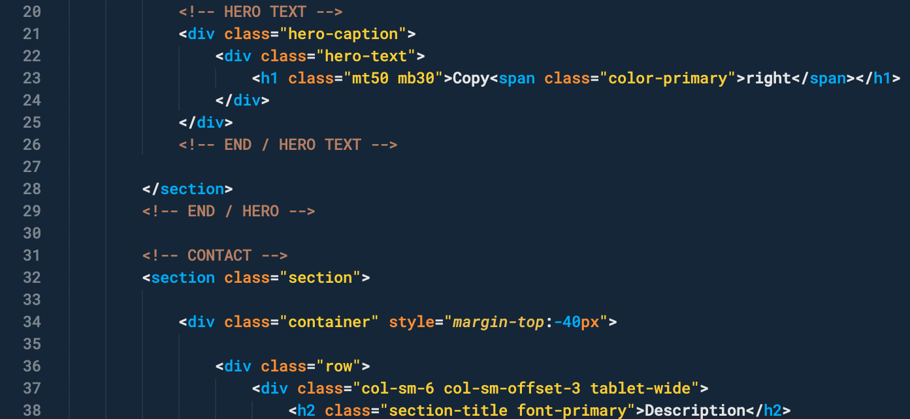

# Hivacruz Color Scheme for Sublime Text

Here is my Color Scheme for Sublime Text 3. Works best with The [Material Theme](https://github.com/equinusocio/material-theme) (see below).


## How to use it?

There are two ways of using it:

* Use it with your own theme or the built-in themes of Sublime Text ;
* Use it with the [Material Theme](https://github.com/equinusocio/material-theme) and the "Palenight" sub-theme (recommended).

## Installation

I'm using the **Roboto Mono Medium Nerd Font Complete** font in my screenshots. On macOS, you can install it with Homebrew like this:

```sh
brew tap homebrew/cask-fonts
brew cask install font-robotomono-nerd-font
```

### Via Package Control

1. `Tools` → `Command Palette...` → `Package Control: Install Package` → `Hivacruz Color Scheme`.
2. Select `Preferences → Color Scheme ...` and pick `Hivacruz` from the menu.

### Manual Installation

1. Download the `Hivacruz.tmTheme` file from this repo.
2. Select `Preferences → Browse packages` from the main menu.
3. Copy `Hivacruz.tmTheme` files to `Packages/User/`.
4. Select `Preferences → Color Scheme ...` and pick `Hivacruz` from the menu.


## What theme is best for this color scheme?

### Material Theme

Despite not being under active development anymore, the [Material Theme](https://github.com/equinusocio/material-theme) remains one of the best Sublime Text Themes. I strongly recommend it to fit with this color scheme.

You can install this awesome theme through the [Package Control](https://packagecontrol.io/installation).

1. Press ⌘/Ctrl + ⇧ + P to open the command palette.
2. Type `Package Control: Install Package` and press enter. Then search for `Material Theme`.

#### Activate the theme

Then you can active the theme from `Preferences > Packages Settings` and choose `Material Theme > Activate`.

Now go again to `Preferences > Packages Settings` and choose `Material Theme > Configuration` this time. Click on `Theme` and pick `Material-Theme-Palenight.sublime-theme`.


#### Theme settings

Here is the my recommended settings for this theme. To add them, go to `Preferences > Settings`. Add/replace the following lines:

```json
	"color_scheme": "Packages/User/Hivacruz.tmTheme",
	"font_face": "Roboto Mono Medium Nerd Font Complete",
	"font_size": 12,
	"line_padding_bottom": 1,
	"line_padding_top": 1,
	"bold_folder_labels": true,
	"material_theme_accent_cyan": true,
	"material_theme_accent_scrollbars": true,
	"material_theme_bright_scrollbars": true,
	"material_theme_compact_sidebar": true,
	"material_theme_contrast_mode": true,
	"material_theme_small_statusbar": true,
	"material_theme_small_tab": true,
	"material_theme_tabs_separator": true,
	"material_theme_titlebar": true,
	"material_theme_tree_headings": true,
	"theme": "Material-Theme-Palenight.sublime-theme",
	"mini_diff": false
```

### Built-in themes or others

If you don't have any theme installed already and you don't want to install any, I suggest you to use the "Adaptive" built-in theme of Sublime text to fit with this color scheme.

To do that, just go to `Preferences` → `Theme` and pick `Adaptive`.

The Color scheme with this theme will look like this:


## Examples

Here are some examples of how the color scheme treats popular languages.

### Python


### PHP


### Bash


### JS


### CSS


### HTML



### YML


### Markdown


## Pull Requests

Feel free to submit changes to the color scheme. It's a work in progress and it lacks some features. Some are:

* Better colors for incremental diff (at the moment I disabled it with `"mini_diff": false`)
* Better colors for Markdown (through Markdown Editing package or by itself?)

 ## Same theme in other apps

 I made similar themes with the same colours for different applications. Here there are:

 - Typora Theme: https://github.com/kinoute/typora-hivacruz-theme
 - Vim Theme: https://github.com/kinoute/vim-hivacruz-theme
 - VSCode Theme: https://github.com/kinoute/vscode-hivacruz-theme
 - iTerm2: https://github.com/kinoute/hivacruz-itermcolors
 - Nova: https://github.com/kinoute/hivacruz-nova-theme

## Credits

Created by Yann Defretin. Heavily inspired by [Coda 2.5](https://panic.com/coda)'s Panic Palette written by Cabel Sasser.